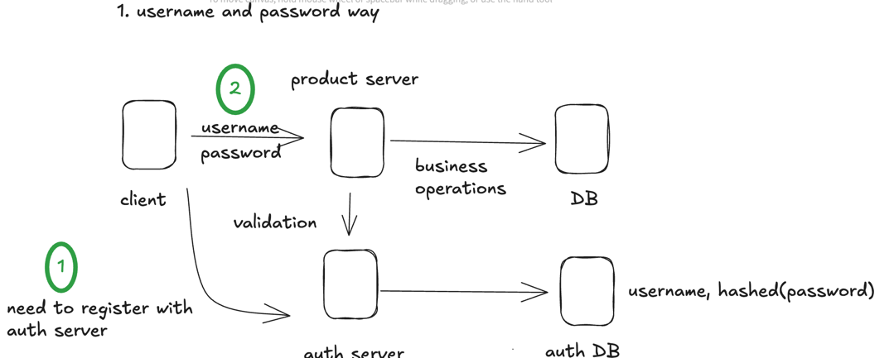
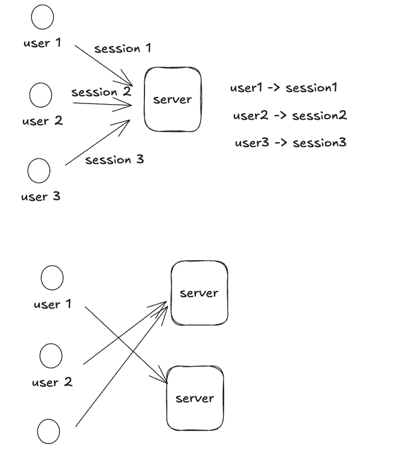
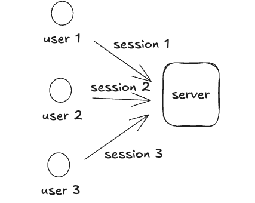

What are?
- HTTP
- Websocket
- Socekt.io
- GraphQL
- gRPC
- MQTT

Why do we have a separate server and db for auth here?
- to reuse for the multiple business production servers
- centralised the auth logic (auth server and db)
- easy to assign ownership to auth specialist team for maintain

Why do we can't go with username and password? Instead of JWT?
- To avoid the session objects in the server (session object need to store some information about the user. Like the expiration of the session, the user's role, etc)
- JWT is stateless, so don't have to store the session in the server
- Easy to define scopes and roles in JWT
- Since JWT is serverless, the server can be scaled easily

After login to the server by submit the username, password, then how the server store the user's information? Let's say we need
to see the expiration of the session, the user's role, etc.
 -using the session object and store the session object in the server
 -use JWT and store the JWT in the client side 

How to create a cookie?

What is the difference between JWT and OAuth?

How to make api with v2 version?

There is another frontend and backend server to create and modify user? Or we can go with database query. what is the best option?

@PreAuthorize, @PostAuthorize, or @Secured ?
